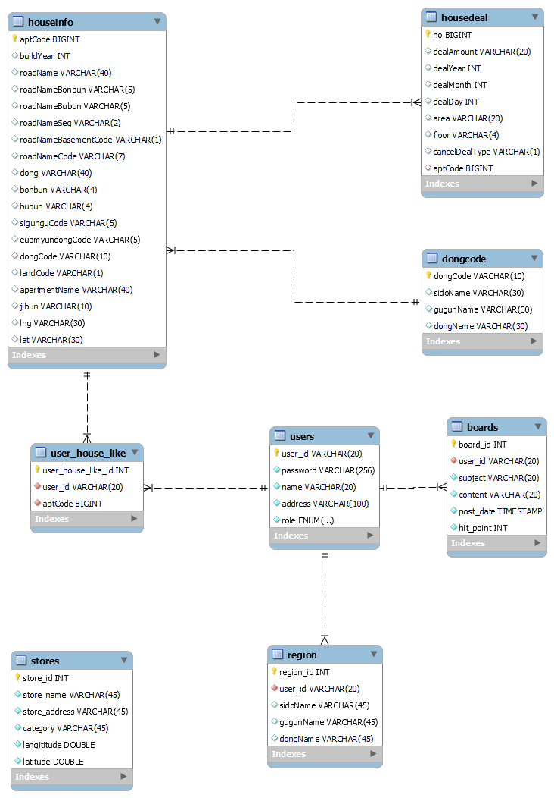
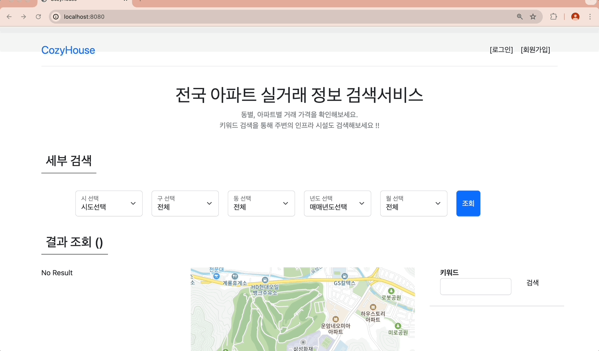
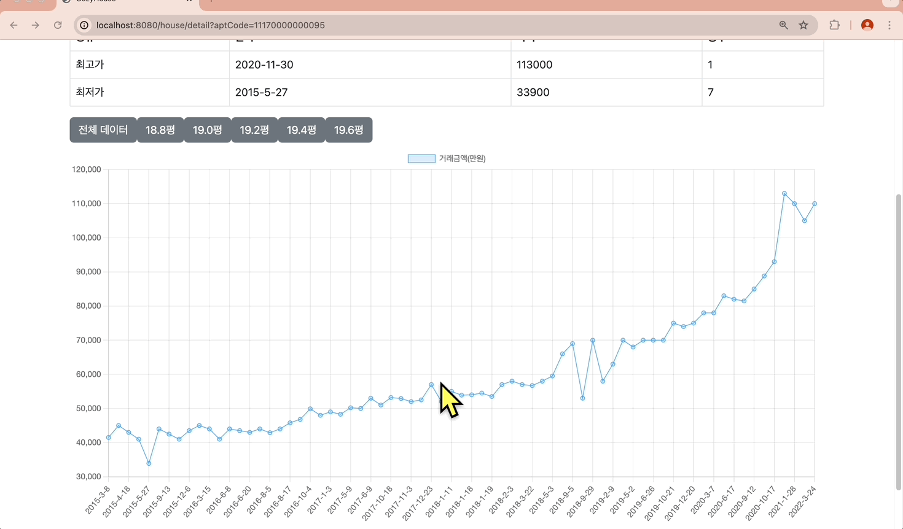

# 🏠 CozyHouse - 당신이 갖게 될 아늑한 집을 위해 - Spring PJT

## 🗒️ 프로젝트 요약 테스트 진짜 ㅃ바뀜요

- 주택 실거래 공공데이터를 활용해 나에게 딱 맞는 집을 찾도록 도와주는 플랫폼
- 삼성 청년 SW 아카데미(SSAFY) 11기 1학기 Back-End 관통 프로젝트
- 사용 데이터 : OpenAPI 내 "국토교통부 아파트매매 실거래 상세 데이터" 등

<br>

## ✔️ 프로젝트 목표

<br>

📌 Spring Boot를 활용하여 서비스 구축

📌 RESTful하게 프로젝트 설계

<br>

## ✔️ 프로젝트 일정

2024-04-26 ~ 2024-04-28

<br>

## ✔️ 팀원

- 11기 광주캠퍼스 Java 전공반 고민호
- 11기 광주캠퍼스 Java 전공반 박선홍

## ✔️ Files
```shell
├── src                            # Java 코드파일
└──  resources                     # Schema파일 및 Diagram파일 저장 directory
      ├── home_DDL.sql
      ├── home_DML.sql
      └── home_ERDiagram.png
```

<br>

## ✔️ 기술 스택


<br>
<br>
<br>

# 📋 DataBase
## 1. Diagram

### 1.1 ERDiagram


## 2. 상세설명
### 2.1. User
- 서비스 이용자가 사용할 수 있는 기능을 다루는 Actor
- 상세 테이블
  - **users** : 회원 정보를 관리하는 테이블
  - **region** : 서비스 이용자의 관심지역 관리하는 테이블
  - **boards** : 공지사항 게시판을 관리하는 테이블
  - **user_house_like** : 서비스 이용자가 선호하는 주택을 저장(찜) 및 관리하기 위한 테이블


## 2.2. House
- 주택 실거래 데이터 및 주택 거래 데이터를 다루는 Actor
- 상세 테이블
  - **houseinfo** : 서비스 내에서 조회할 수 있는, 전국 아파트 데이터가 담긴 테이블
  - **housedeal** : houseInfo 테이블의 aptCode와 mapping되며, 상세 거래 내역을 다루는 테이블
  - **dongcode** : 전국 시군구 지역코드를 관리하는 테이블


## 3. Store
- 동네 업종 정보를 관리하는 Actor
- 상세 테이블
  - **stores** : 전국의 업종별 데이터를 관리하는 테이블

# 💡 상세 기능

## 1. 필수 기능

### 1.1 메인페이지

### 1.2 회원관리 페이지

- 직접 회원가입을 할 수도 있음


- 회원정보를 관리자가 등록할 수 있음

- 관리자는 회원정보를 수정할 수 있음

- 괸리자는 회원정보를 삭제할 수 있음

- 관리자는 아이디를 제외하고 회원정보를 수정할 수 있음

- 관리자는 주소, 역할에 따라서 회원정보를 검색할 수 있음


### 1.3 로그인, 로그아웃 페이지
- 로그인, 로그아웃 기능을 제공


### 1.4 실거래가 검색, 결과 페이지
- 행정동 및 날짜 기준으로 주택 실거래가 검색 기능
- 결과 조회를 클릭하면 상세정보를 검색할 수 있음


## 2. 추가 기능
### 2.1 관심지역 찜하기 기능
- 주택 상세 페이지에서 사용자는 찜하기를 통해 원하는 지역의 주택을 찜 등록할 수 있음
- 로그인한 사용자에게만 찜하기 기능이 활성화되며, 마이페이지에서 찜 목록을 볼 수 있음
- 비동기 방식으로 toggle 버튼 기능을 구현 


- 사용자는 마이페이지에서 찜한 주택의 상세정보에 바로 접근할 수 있음
- 또한 일괄적으로 찜 삭제도 가능함


### 2.1 - 주변 업종 정보 검색(카카오맵)
- Kakao Map API를 활용해 주택 근처 편의시설 검색 기능 제공
- 검색어를 입력하여 주위에 어떤 업종이 있는지 손쉽게 검색할 수 있음
- 사용자의 편의성을 위해 검색결과 위에 마우스 커서를 올리면 자동으로 지도 위에서 tracking 가능


## 3. 심화기능
### 3.1 공지사항 기능
- 일반 회원은 공지사항 조회만, 관리자는 조회 및 작성 가능 

- 공지사항 조회시 조회 수 증가

- 관리자의 공지사항 수정

- 관리자의 공지사항 삭제


### 3.2 상세페이지에 시세 정보 그래프 제공

- 상세보기를 선택한 주택의 지난 거래내역을 line-chart로 시각화
- 평방미터(m2)를 평 수로 변환하여 주택의 크기에 대해 쉽게 알 수 있도록 함
- 평수별로 아파트 거래내역 그래프를 볼 수 있도록 기능 차별화
- 거래내역 최고가, 최저가를 볼 수 있음
